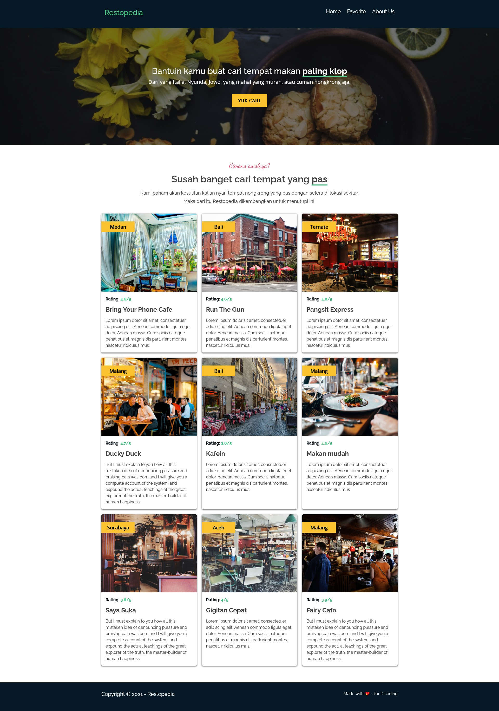

# Submission 1

## Preview

## Criterias

Submission has to implement:

- App Bar (Navigation Bar)
- Hero Element (Jumbotron Element)
- Restaurant List
- Footer
- Responsive Views
- Accessibility Support

Another ruleset from Dicoding:

- Use Webpack
- No CSS Frameworks
- UI is niche
- Project must be build-able
